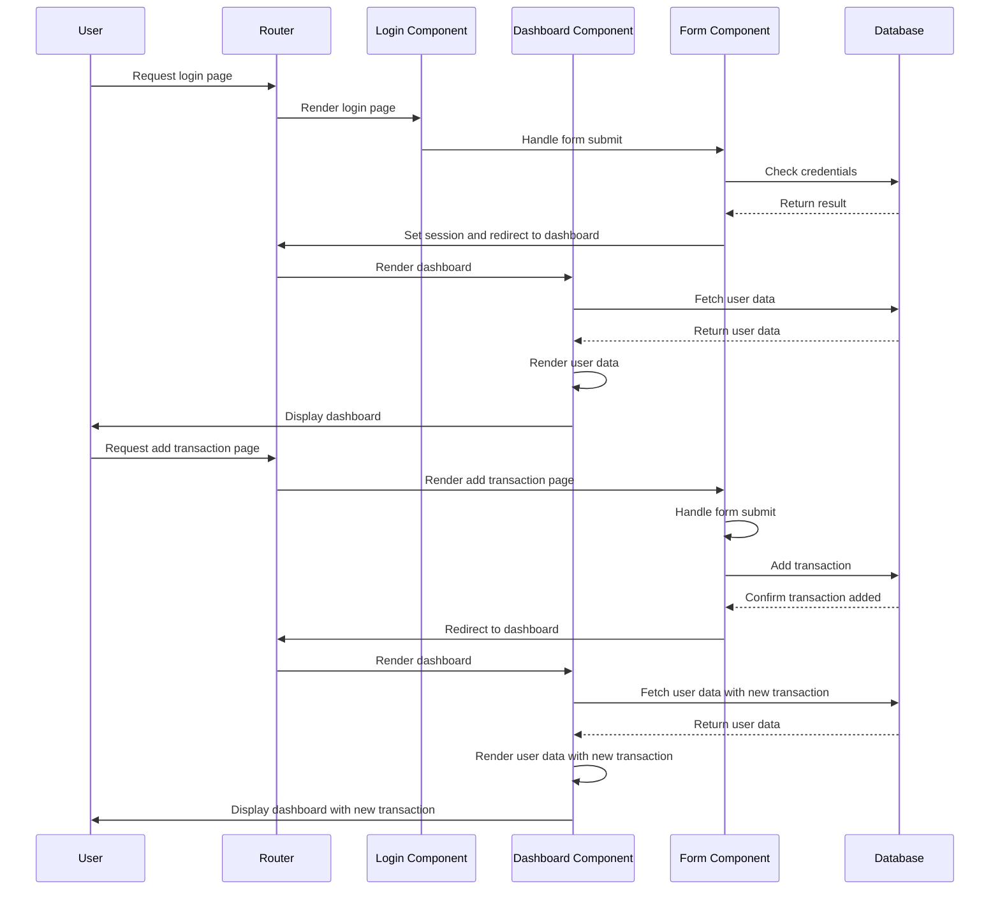
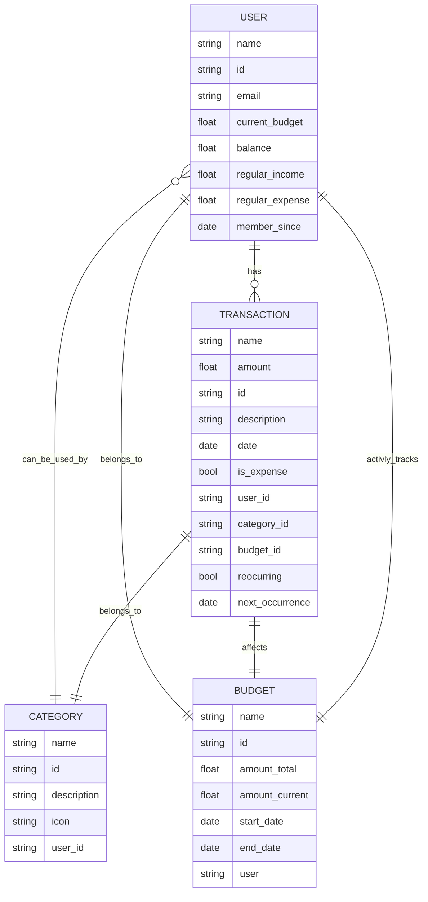
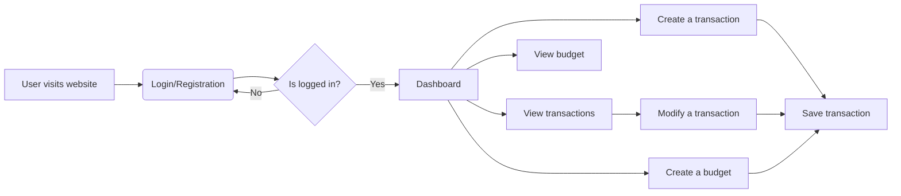

# Notes and Todos for the final presentation

A summary of all important information, still required changes and other annotation before the final presentation.

## **Notes**

Notes for the presentation and the resulting report.

### Diagrams

Please collect and validate all diagrams used during the presentation, amongst which should be some elaborating on the requirements / use case as well as the architecture of the application.

#### Requirements related diagrams list

- [ ] **Use Case Diagram** (Dennis)
- [ ] ...

#### Application architecture diagrams list

- [ ] **Component Diagram** (Dennis)
- [ ] ...

### Patterns

YES WE HAVE MCV - BUT BASICALLY EVERY GUI APP DOES
Given that our codebase *works*, but the same way monkeys *work* on crack, we should consider refactoring our codebase to use the following patterns:

- [ ] **Factory Pattern** for the creation of new transactions and other reused components, which is partly implemented but not clearly used and separated
- [ ] **Observer Pattern** there should be a budgeting component, which listens to new transactions and updates the budget accordingly
- [ ] **DAO Pattern**  for the database access, which is currently implemented in a very hacky way, we should write a clear DAO class, which ad hoc db access and provides a clean interface for the rest of the codebase
- [ ] **Command Pattern** for the undo/redo functionality, we could write a clear Command class, which encapsulates the undo/redo functionality and potentially other functionality
- [ ] **Singleton Pattern** We are making sure by default only **one** user is logged in and only one budget is active at a time, we could use a singleton pattern more clearly to further ensure this

### Data Model and Architecture

See the [Data Model document](Datamodel.md) for a detailed description of the data model.

A write up for the architecture of the application should be added to the [Architecture document](Architecture.md).

### Test, CI and documentation

- [ ] **OH FUCK WE FORGOT ABOUT DOCUMENTATION** I will take care of this asap (Seb)
- [ ] **Test** We currenlty use vercel to deploy our application, and test every build and preview for successful builds and linting errors upon pushes to master
- [ ] **CI** We currenlty use github actions to run our tests and call deploy to vercel (out hosting partner)

### Automization

See above

## TODOs

- [ ] **WE ARE MISSIGN A GDPR THINGYY**
- [ ] **Past budgets** We should add a feature to view past budgets, but currently i think we should just update the start and end date after passing the end date
- [ ] **Page files** almost all pages currently contain functionality which sould be within components, fixing this will also help us establish clear patterns and better code quality

- [ ] Here i would like to summarize TODOS in correspondence to our milestones and scrum board, as well as last minute fixed or direct feedback to the codebase / presentation

## German bulletpoints for the presentation

### Slide notes

- [ ] **Architekturmuster** Einige Beispiele verwendeter klassischer Architektur Muster (Seb)
  - **MVC Pattern**
  - Nuter Interface gerenderte "page" files sind kalr von der applikationslogik getrennt und werden durch die Controller verwaltet
  - **Singleton Pattern**
  - Effektiv jede mit "const" gekennzeichnete Variabel in js ist ein singleton...
  - Nutzer authentifikation und Datenbank refferenz können immer nur als einzigartige Referenz existieren und werden in grenzfällen erstzt statt dupliziert.
  - **Factory Pattern**
  - Transaktionen werden nach einem Factory Pattern erstellt, wobei eine teilliste der Datenbank zusammen mit verschiendenen als Template dienenden Komponentnen einzele Elemente erstellt und rendert.
  - **DAO Pattern**
  - "recent" Transaktionen werden als Datenobject zwischengespeichert um erste Zugriffe schneller, teils offline und / order vor Datenbankverbindung zu ermöglichen
  - **Observer Pattern**
  - Budgets werden als Observer registriert und werden bei neuen Transaktionen aktualisiert
  - **Command Pattern**
  - Änderungen an Transaktionen sowie Budgets folgen bekannten Kommandos, welche ausschließlich über die Datenbank abgespeichert werden und somit auch wiederherstellbar sind.
- [ ] **Datenmodell** (Seb)
  - TODO: Mermaid graph und keynotes
- [ ] **Test, CI & Automatisierung** (Seb)
  - Besipiel graph für deployment und testing workflow
- [ ] **Dokumentation** (Seb)
  - API doku nur bedingt nützlich und wird durch md files und inline doku abgedeckt **!LEARNING: do not overcomplicate**
- [ ] **Tecnical Learnings**
  - Hin und her mit DB scheme, hosting partner und automation workflow -> BDUF can be useful sometimes, think of scaleing early on
  - Überkomplikation durch fokus auf "potentielle" Features und veralgemeinerung -> Fix the engine before painting your car
  - Steep learning curves durch verwenden neuerer frameworks und instabiler libs -> When shipping: Use what you know, not what you want to learn
  - Zeitverlust durch zu spätes technisches refactoring -> Enforce code quality durch custom linting / besseres testing
  - Nicht technische nutzer benötigen eignes onboarding / tooling -> nächstes mal Storyblocks verwenden

### Slide graphs

#### Application sequence diagram

#### Datamodel ER Digram

- A USER can have multiple TRANSACTION, and each TRANSACTION belongs to one USER.
- A USER can also have multiple BUDGETs and actively tracks all of them.
- A TRANSACTION can belong to one CATEGORY and affects one BUDGET.
- A CATEGORY can be used by one or more USERs
- A BUDGET belongs to one USER

#### Activity Diagram

- User visits the website (A)
- User is presented with a login or registration page (B)
- If the user is already logged in, they are taken to the dashboard (C --> D)
- If the user is not logged in, they are asked to log in or register (C --> B)
- Once on the dashboard, the user can create a new transaction (D --> E)
- When the user finishes creating the transaction, they save it to the Firebase database (E --> F)
- The user can also view a list of all their transactions (D --> G)
- If the user wants to modify a transaction, they select it from the list (G --> H)
- Once the user is done modifying the transaction, they save the changes (H --> F)
- The user can also create a new budget (D --> I)
- The user can view the progress of the budget they created (D --> J)

